# CrypterChat

Phone-number messaging with **ChatScan X11 blockchain** message integrity.

Users register and chat with normal E.164 phone numbers. When a message is sent it is encrypted and committed through [ChatScan](https://github.com/crypterchat/chatscan): the public chain stores only the **ciphertext hash** and metadata. Message content is never publicly readable.

| Layer | Role |
| --- | --- |
| Phone login | Normal OTP-style identity (`+1555…`) |
| Messaging bridge (`messaging/`) | Delivers encrypted envelopes between users |
| ChatScan (`chatscan/`) | X11 chain + explorer — immutable hash records only |
| Flutter app (`lib/`) | Mobile client; 1:1 sends also commit to ChatScan |

## Demo media

### OpenPGP + ChatScan (latest)

Live run: Alice encrypts with **OpenPGP**, Bob decrypts, ChatScan stores **hash only** (`protocol: PGP`, `contentAvailable: false`).

<video src="docs/media/crypterchat-pgp-chatscan-demo.mp4" controls width="100%"></video>

[Watch the OpenPGP demo video](docs/media/crypterchat-pgp-chatscan-demo.mp4) · [Machine-readable snapshot](docs/media/pgp-demo-snapshot.json)

| Screenshot | What it shows |
| --- | --- |
| 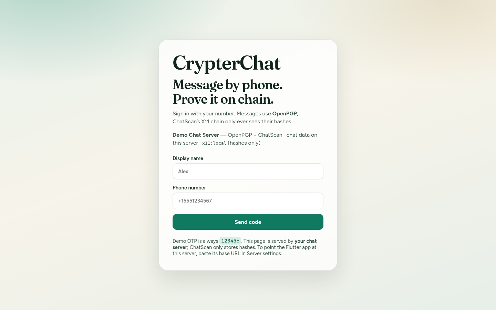 | Phone login — OpenPGP + your chat server |
| 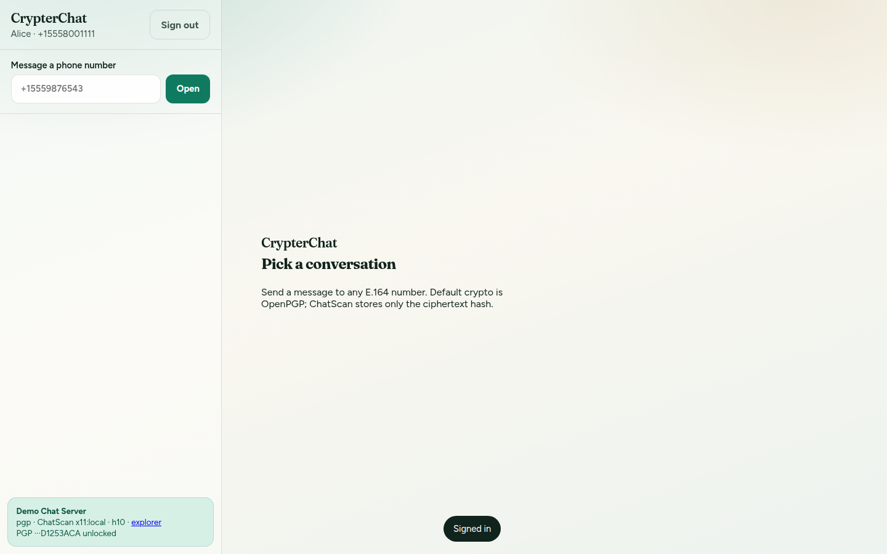 | Signed in with PGP fingerprint unlocked |
| 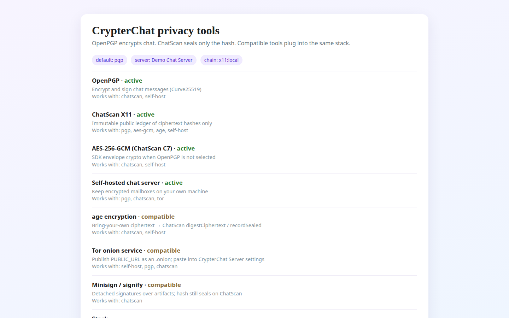 | Active stack: OpenPGP, ChatScan, self-host (+ age/Tor compatible) |
| 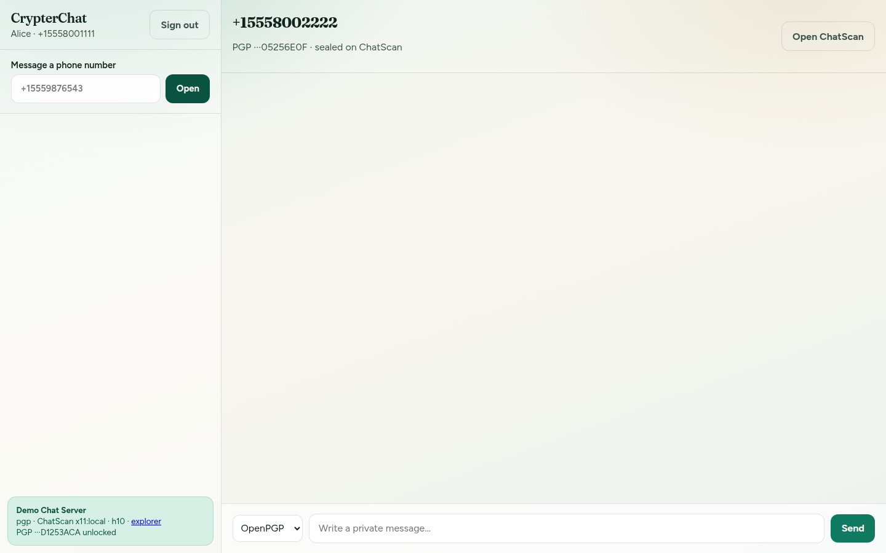 | OpenPGP selected in the composer |
| 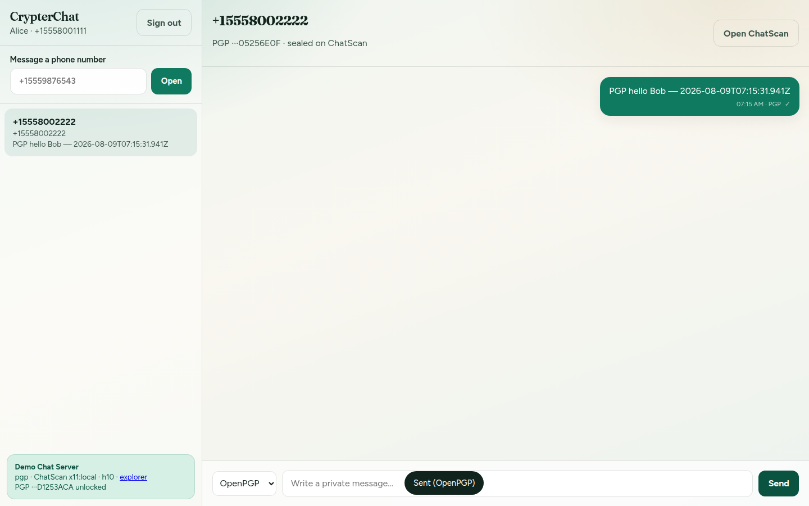 | Normal readable bubble tagged `PGP` |
| 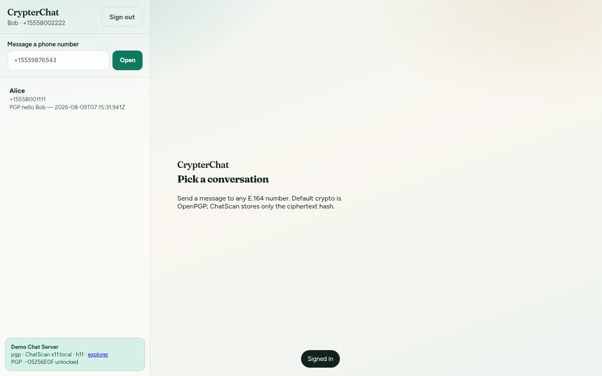 | Bob’s chat list preview (decrypted) |
| 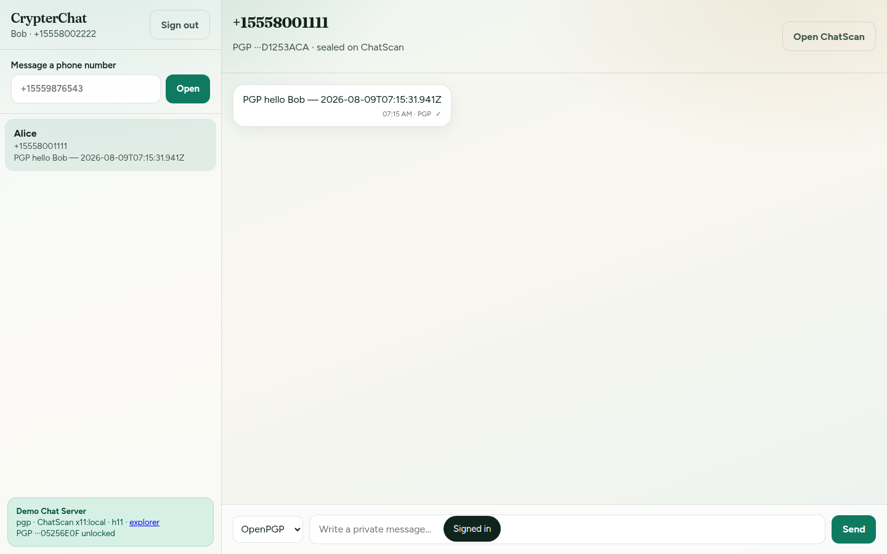 | Bob reads the same plaintext after OpenPGP decrypt |
| 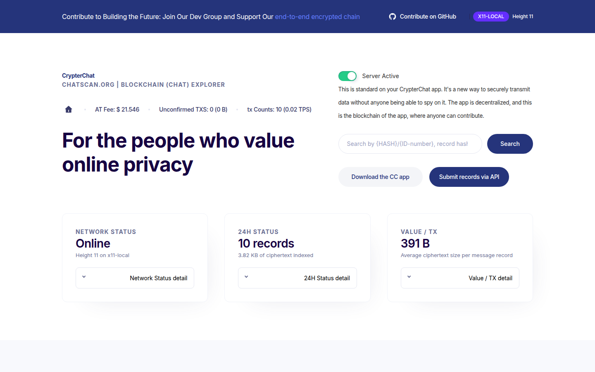 | ChatScan indexing ciphertext digests |
| 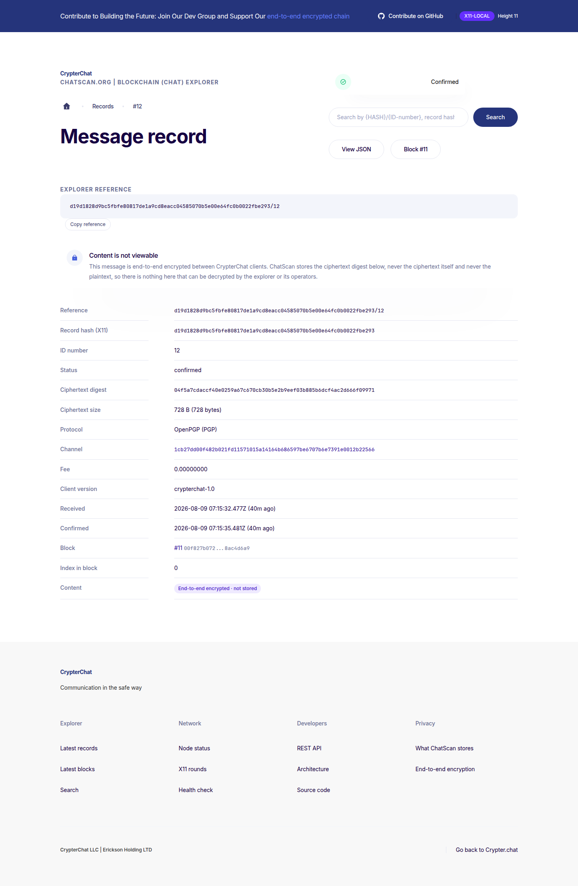 | Public record: **Content is not viewable** |

Flutter app (server URL + OTP):

| Screenshot | What it shows |
| --- | --- |
| 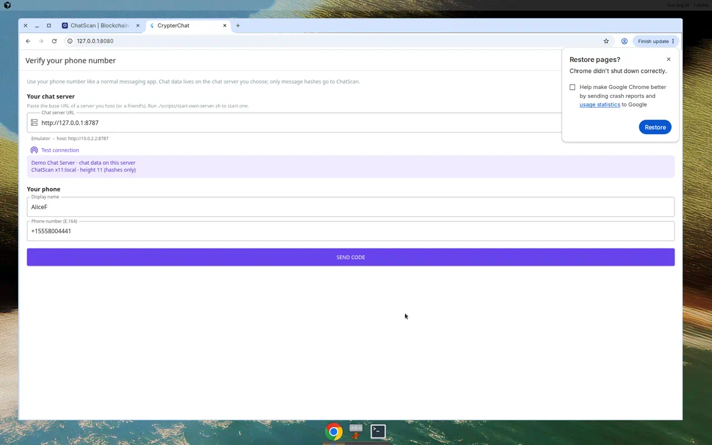 | Flutter demo — paste chat server URL, phone login |
| 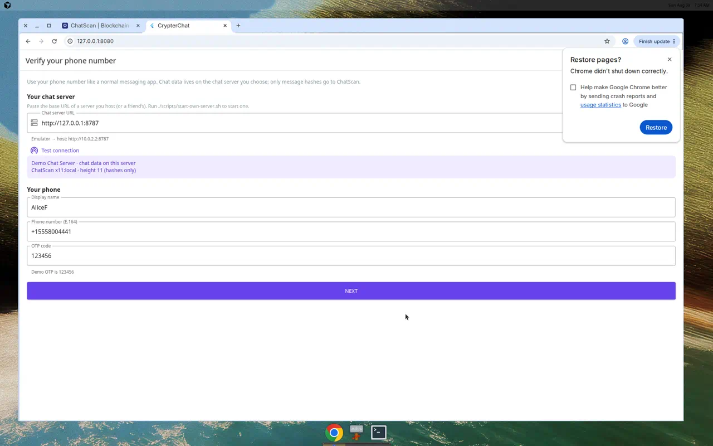 | Demo OTP `123456` |

Reproduce the capture:

```bash
./scripts/start-own-server.sh
cd messaging && npm install
npm run test:pgp
node scripts/ui-demo-pgp.mjs
# writes docs/media/pgp-*.png + crypterchat-pgp-chatscan-demo.mp4 + pgp-demo-snapshot.json
```

### Earlier ChatScan walkthrough

<video src="docs/media/crypterchat-chatscan-demo.mp4" controls width="100%"></video>

[Watch the earlier demo video](docs/media/crypterchat-chatscan-demo.mp4)

| Screenshot | What it shows |
| --- | --- |
| 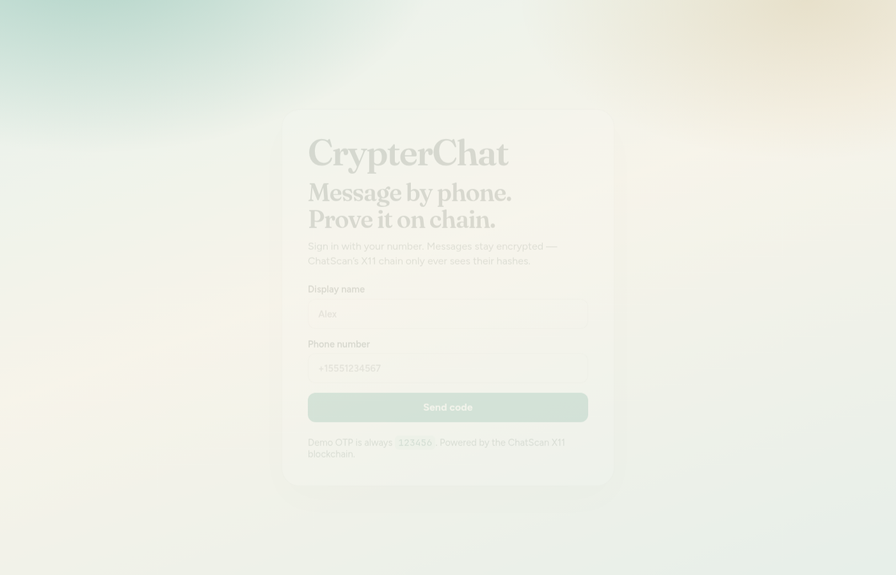 | Phone-number sign-in (CrypterChat) |
| 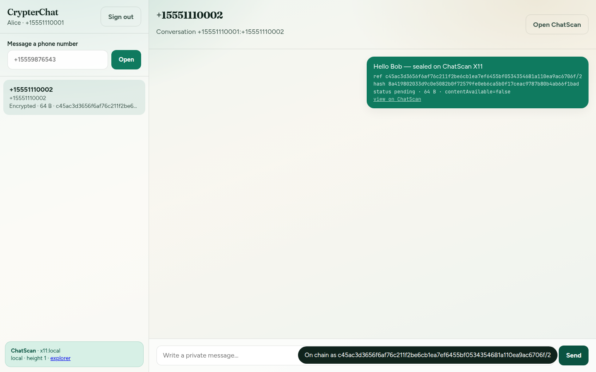 | Alice’s message with on-chain `ref` / hash / `contentAvailable=false` |
| 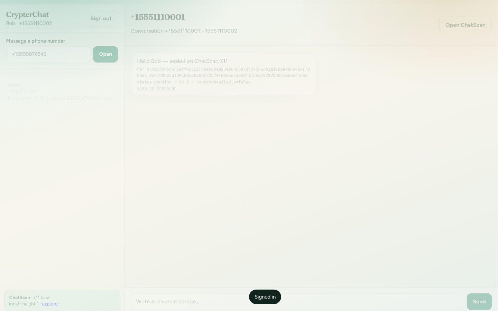 | Bob decrypts the same message |
|  | ChatScan dashboard indexing ciphertext digests |
| 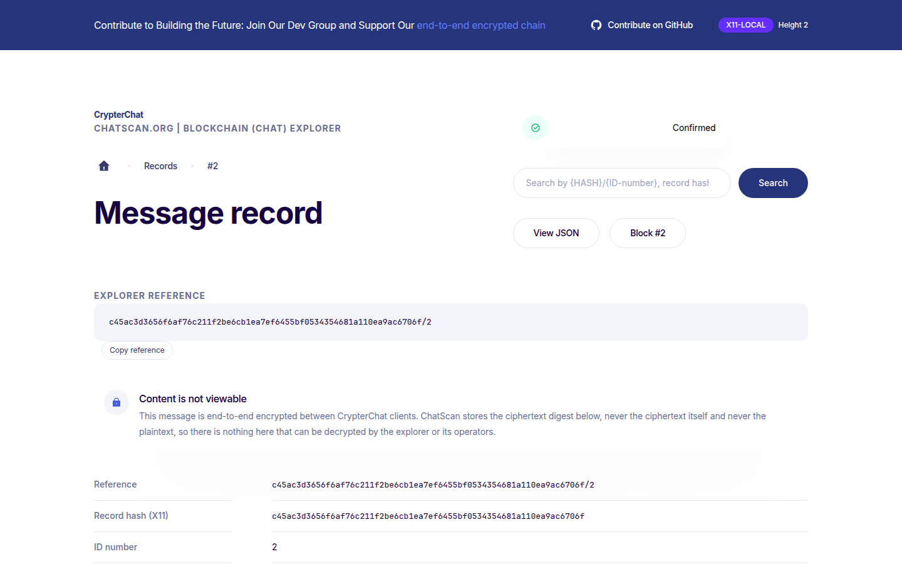 | Public record: **Content is not viewable** |
| 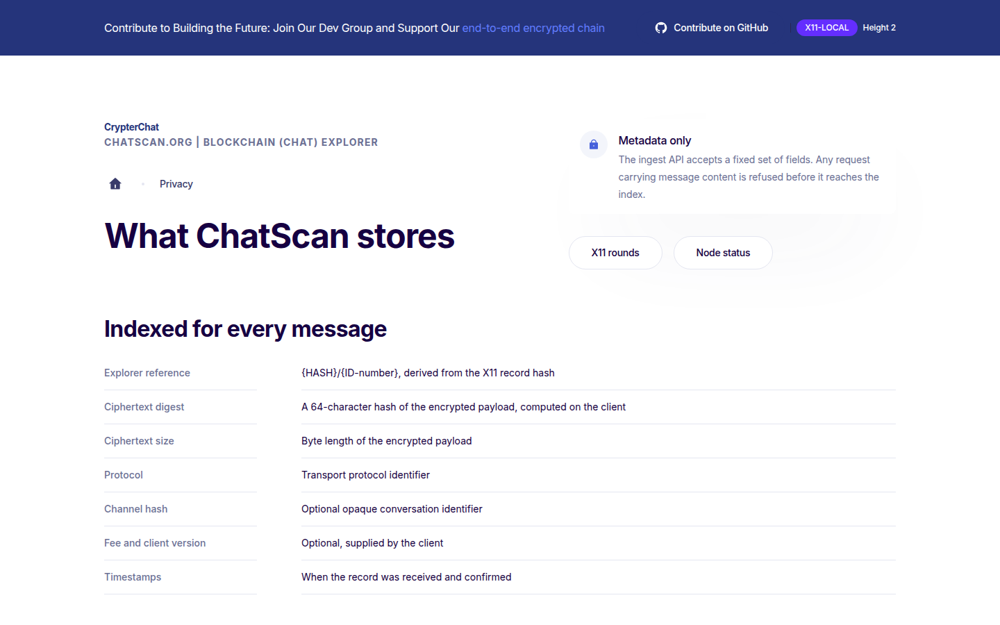 | What ChatScan stores vs refuses |

## How messaging works on ChatScan

```
Alice encrypts with OpenPGP (default)
        │
        ├─ armored ciphertext ──▶ your chat server mailbox (Bob decrypts)
        │
        └─ SHA-256(ciphertext) + metadata ──▶ ChatScan X11 (protocol PGP)
```

* ChatScan **rejects** any ingest that includes `content`, `body`, `text`, `message`, `plaintext`, etc.
* Explorer records always report `contentAvailable: false`.
* Records are append-only / immutable once sealed into an X11 block.
* The public address of a message is `{HASH}/{ID-number}` (e.g. `c45ac3d3…6706f/2`).

The ChatScan component is vendored from upstream:

```text
https://github.com/crypterchat/chatscan.git  →  chatscan/
```

Do **not** replace ChatScan with a conventional database for message integrity. The messaging bridge only stores encrypted envelopes for delivery; the chain is the public, immutable ledger of digests.

## Requirements

* **Node.js 20.11+** (no npm dependencies for ChatScan or the messaging bridge)
* Optional: Flutter 3.x + Firebase for the mobile app
* Optional: a CDCI `centraldatabased` node for production anchors (local X11 sealer is used by default)

## Quick start (fully functional web app)

```bash
git clone https://github.com/crypterchat/mainapp.git
cd mainapp
./scripts/start-stack.sh
```

Then open:

* **CrypterChat UI** — http://127.0.0.1:8787  
* **ChatScan explorer** — http://127.0.0.1:3000  

### Sign in with a phone number

1. Enter a display name and an E.164 phone number (e.g. `+15551110001`).
2. Use demo OTP **`123456`** (local mode does not send SMS).
3. Open a chat with another number (e.g. `+15551110002`).
4. Send a message — peers see normal readable bubbles; ChatScan seals the hash only.
5. Sign out, sign in as the recipient with OTP `123456`, and read the message.
6. Open the ChatScan explorer — only the hash/metadata is public (`contentAvailable=false`).

### Manual start (two terminals)

```bash
# Terminal 1 — ChatScan local X11 chain
cd chatscan
CHATSCAN_CHAIN_BACKEND=local CHATSCAN_BLOCK_INTERVAL_MS=5000 npm start
# http://localhost:3000

# Terminal 2 — messaging API + UI
cd messaging
CHATSCAN_URL=http://127.0.0.1:3000 DEMO_OTP=123456 npm start
# http://localhost:8787
```

## Testing blockchain messaging

Automated send/receive + chain privacy check:

```bash
# with the stack running
cd messaging
node scripts/e2e-send-receive.js
```

Expected:

* Alice’s send returns a ChatScan `ref`
* `chainRecord.contentAvailable === false`
* Bob’s mailbox decrypts the original plaintext
* ChatScan history lists the ciphertext hash only

Headless UI demo (screenshots under `docs/media/`):

```bash
# requires puppeteer-core + Chrome (see messaging/scripts/ui-demo.mjs)
node messaging/scripts/ui-demo.mjs
```

Prove ChatScan refuses plaintext:

```bash
curl -s -X POST http://127.0.0.1:3000/api/v1/records \
  -H 'content-type: application/json' \
  -d '{"ciphertextHash":"00","size":1,"content":"leak"}' | head
# → HTTP 400, code: content_rejected
```

## Configuration

| Variable | Default | Purpose |
| --- | --- | --- |
| `CHATSCAN_URL` | `http://127.0.0.1:3000` | Explorer / ingest base URL |
| `CHATSCAN_CHAIN_BACKEND` | `local` | `local` sealer or `cdci` node |
| `MESSAGING_PORT` | `8787` | CrypterChat web UI + API |
| `DEMO_OTP` | `123456` | Local phone OTP (no SMS provider) |
| `CHATSCAN_INGEST_KEY` | _(empty)_ | Optional bearer key for ingest |

Flutter mobile bridge (see `lib/Configs/optional_constants.dart`):

* `EnableChatScanBlockchain` — commit 1:1 text sends to ChatScan
* `ChatScanMessagingBaseUrl` — messaging bridge URL (default `http://127.0.0.1:8787`)

## Project layout

```text
chatscan/                 Vendored ChatScan explorer + X11 chain + SDK
messaging/                Phone auth + encrypted delivery + ChatScan bridge
  public/                 CrypterChat web UI
  src/                    API server
  scripts/                e2e + UI demo
lib/Services/chatscan/    Flutter client for the messaging bridge
lib/Screens/chat_screen/  1:1 send path records ChatScan refs on messages
docs/media/               Screenshots + demo video
scripts/start-stack.sh    One-command local stack
```

## OpenPGP + privacy tools

Messaging defaults to **OpenPGP** (encrypt + sign). ChatScan still only stores the ciphertext hash (`protocol: PGP`).

```bash
cd messaging && npm install && npm run test:pgp
curl -s http://127.0.0.1:8787/api/privacy/tools | jq
```

Compatible private tools (age, Tor onion hosting, minisign) are listed in [docs/PRIVACY_TOOLS.md](docs/PRIVACY_TOOLS.md). In the Flutter demo, open the shield icon → **Privacy tools**.

## Host your own chat server

Chat data can live on **your** server while ChatScan stays the shared hash chain.

```bash
export SERVER_NAME="My Chat"
export PUBLIC_URL="http://YOUR_LAN_IP:8787"
./scripts/start-own-server.sh
```

Then in the CrypterChat app, paste that **Base URL** into **Chat server URL** (login screen or Server settings). Friends on the same Wi‑Fi use your LAN IP.

See [docs/SELF_HOST.md](docs/SELF_HOST.md).

| Layer | Who hosts it |
| --- | --- |
| CrypterChat app | Users’ phones / browsers |
| Chat server (`messaging/`) | You (encrypted envelopes + phone accounts) |
| ChatScan | Shared X11 explorer (hashes only) |

## Flutter WhatsApp-style app (runnable demo)

The production Flutter tree under `lib/` still expects a real Firebase
`google-services.json` (the checked-in file is a placeholder). To **run the
WhatsApp-like UI against ChatScan today**, use the dedicated demo app:

```bash
./scripts/start-stack.sh
cd flutter_demo
flutter pub get
flutter run -d chrome --web-renderer html \
  --dart-define=MESSAGING_URL=http://127.0.0.1:8787
# Android emulator:
# flutter run -d android --dart-define=MESSAGING_URL=http://10.0.2.2:8787
```

| Demo asset | What it shows |
| --- | --- |
| 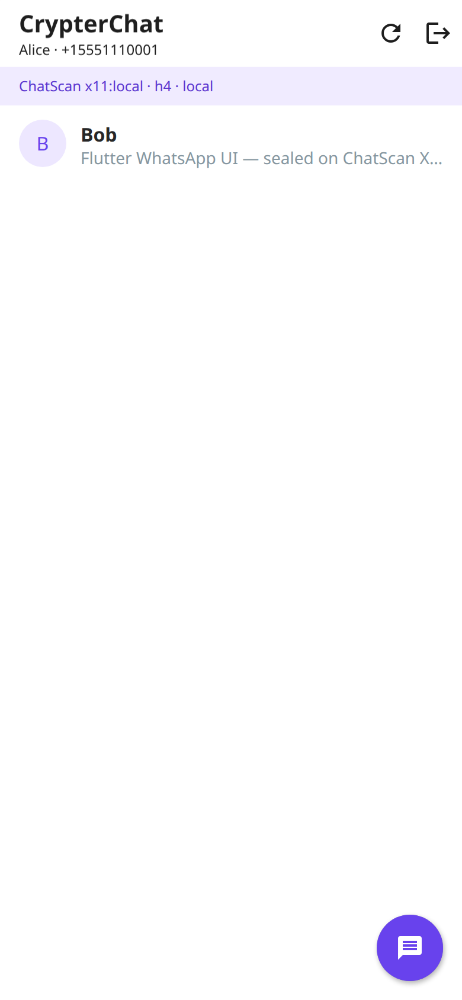 | CrypterChat-style chat list + live ChatScan banner |
| 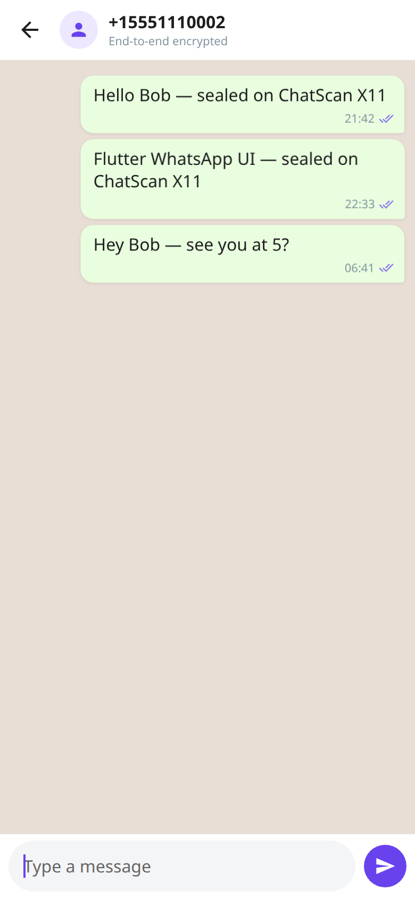 | Normal peer-to-peer bubbles (readable text only) |
| 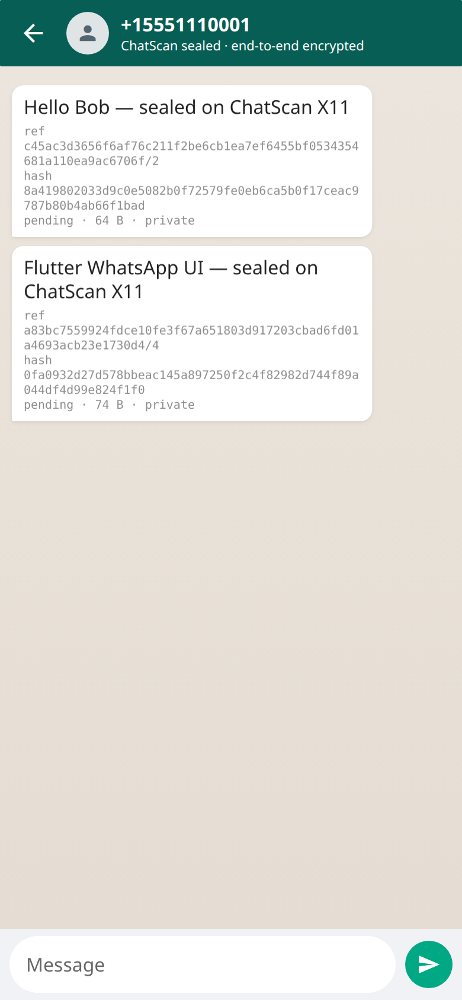 | Recipient sees the same plain messages — not hashes |
| 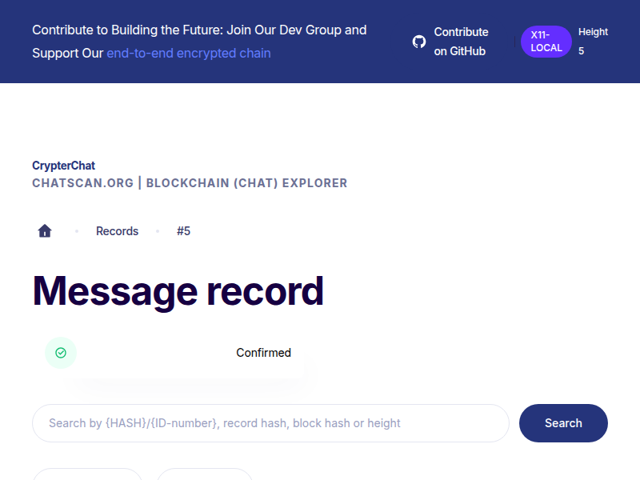 | Public chain still shows hash only (`contentAvailable=false`) |
| [Flutter demo video](docs/media/flutter-whatsapp-chatscan-demo.mp4) | Full Alice → Bob walkthrough |

Peer chat is a normal messaging UI (CrypterChat colors: white peer bubbles, soft-green mine).
Long-press a bubble for optional seal details; **hashes stay on ChatScan**, not in the chat thread.

Details: [`flutter_demo/README.md`](flutter_demo/README.md).

The main app’s 1:1 send path also calls `ChatScanService.recordMessage` (fields
`csRef` / `csHash` / `csUrl` / `csStatus`) once Firebase is configured.

## Production notes

* Run ChatScan against a real CDCI node (`CHATSCAN_CHAIN_BACKEND=cdci`) so commitments anchor in `OP_RETURN` on the X11 chain. See `chatscan/docs/CDCI.md`.
* Set `CHATSCAN_INGEST_KEYS` and never expose wallet RPC credentials to browsers.
* Replace demo OTP with a real SMS provider for phone verification outside local demos.

## License

ChatScan is MIT-licensed (`chatscan/LICENSE`). The CrypterChat application code follows the repository’s existing license terms.
